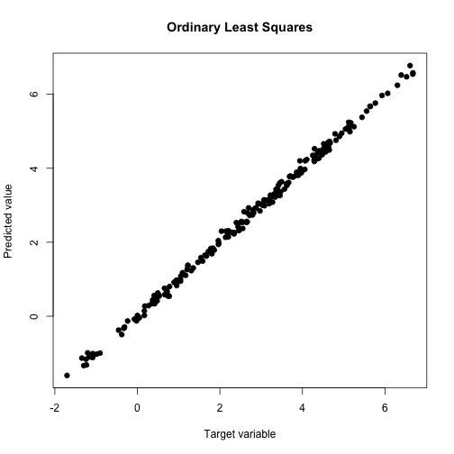

(Generalized) Linear Models
========================================================
css: ../../assets/style/uw.css
author: Sid Rajaram
date: April-06-2017
autosize: true
UW ML410 - Applied Machine Learning
---------------

History of Linear Regression (and Statistics)
===================
right : 80%
<br><center>
Carl Friedrich Gauss<br>1801</center>
***
<br>
- Fit orbit of dwarf planet Ceres to an ellipse with focus at the center of the sun (Kepler)
- Accurately predicted future location of Ceres
<center></center>
- (Optional) If interested, read the math here: <a href="http://www.jstor.org/stable/2690592">http://www.jstor.org/stable/2690592</a>

(Generalized) Linear Models
========================================================
<br>
- Techniques for supervised learning that is based on strong statistical assumptions about the underlying data.<br><br>
- They can be used when the assumptions are not met, but then it needs to be graded based on *performance on the test data*.<br><br>
- Metrics like p-values, F-test statistics, etc...are *valid only if the assumptions are true*.

Linear Regression (Ordinary Least Squares)
========================================================

<br>
$$y = \beta_{0} + \beta_{1}x_{1} + \ldots + \beta_{m}x_{m} + \epsilon,$$<br>
$$\textrm{where }\epsilon \sim \mathcal{N}(0,\,\sigma^{2}).$$
- The $\beta_{i}\textrm{s}$ are called *regression coefficients*.
- There are $m + 1$ of them, i.e., $m + 1$ *degrees of freedom*.<br>

### Assumptions (which are often violated):
- **Homoscedasticity** - $\epsilon$ has constant variance (as a function of $x$).
- **Normally distributed noise** - parameter estimates are sensitive to outliers

Simulate Sample Data
========================================================
<br>

```r
n <-  200
m <- 3

intercept <- 5
true_coeffs <- c(-6, 3, -2)

mat <- matrix( runif( n * m, 0, 1 ), nrow=n, ncol=m ,
               dimnames=list( NULL, c("X1", "X2", "X3") ))
x <- data.frame(mat)

x$cleantarget <- as.matrix(x) %*% true_coeffs + intercept

x$olstarget <- x$cleantarget + rnorm(n, mean=0, sd=0.1)
```

Fit to Linear Regression Model
========================================================


```r
mdl <- lm( olstarget ~ X1 + X2 + X3, data = x)
summary(mdl)
```

```

Call:
lm(formula = olstarget ~ X1 + X2 + X3, data = x)

Residuals:
      Min        1Q    Median        3Q       Max 
-0.202535 -0.062805 -0.004556  0.065929  0.225712 

Coefficients:
            Estimate Std. Error t value Pr(>|t|)    
(Intercept)  4.99829    0.02156  231.88   <2e-16 ***
X1          -5.99523    0.02551 -235.00   <2e-16 ***
X2           3.01079    0.02322  129.69   <2e-16 ***
X3          -2.01672    0.02305  -87.47   <2e-16 ***
---
Signif. codes:  0 '***' 0.001 '**' 0.01 '*' 0.05 '.' 0.1 ' ' 1

Residual standard error: 0.0957 on 196 degrees of freedom
Multiple R-squared:  0.9975,	Adjusted R-squared:  0.9975 
F-statistic: 2.637e+04 on 3 and 196 DF,  p-value: < 2.2e-16
```

Visualize Fit
========================================================
<center>

```r
plot(x$olstarget, fitted(mdl), main="Ordinary Least Squares", 
  	xlab="Target variable", ylab="Predicted value", pch=19)
```


</center>
Logistic Regression
========================================================

Let $y \in \{0, 1\}$ be a random variable (the target) and $X = x_1, \ldots, x_m$ be a set of _independent_ variables (the predictors). Then

$$
y \sim \mathcal{Ber} (p(X))
$$

where

$$
p(X) = f(\beta_0 + \beta_1 x_1 + \beta_2 x_2 + \cdots + \beta_m x_m)
$$

and $f$ is the _logistic function_

$$
f(t) = \frac{1}{1 + e^{-t}}
$$

Simulate and Fit to Logistic Regression Model
========================================================


```r
x$logistic <- 1/(1+exp(-x$cleantarget))

x$logistictarget <- rbinom(n,1,x$logistic)

logisticmdl <- glm( x$logistictarget ~ X1 + X2 + X3, data=x, family="binomial")

confint.default(logisticmdl)
```

```
                2.5 %    97.5 %
(Intercept)  3.271992  7.596212
X1          -8.337058 -3.411531
X2           1.649449  5.378492
X3          -5.080425 -1.368470
```

Visualize Logistic Fit
========================================================
<center>

```r
plot( x$cleantarget, x$logistictarget, main="Logistic Fit", 
  	xlab="w^T.x", ylab="Target and Predicted variable", pch=19 )

points( x$cleantarget, fitted(logisticmdl), col=2, pch=19 )

legend(5, 0.5, legend=c("Target variable", "Predicted value"),
       col=c("black", "red"), lty=1, cex=0.8)
```


</center>

Linear Regression Loss Function
========================================================
- Regression coefficients are inferred by minimizing a loss function
- In linear regression, this loss function is the mean squared error (MSE):<br><br>
$${\cal L} (X) := \frac{1}{N} ||\beta^T X - y||^2$$<br>
- $X$ is an $M$ x $N$ matrix of features ( $X_{i}$ s are columns of $X$),
- $\beta$ is an $M$ x $1$ vector of regression coefficients, and
- $y$ is a $1$ x $N$ vector of targets.

Logistic Regression Loss Functions
========================================================
<br>
- In Logistic Regression, the loss function is the *cross-entropy* of the observed and predicted target variable:<br><br>
$${\cal L} (X) := \frac{1}{N}\sum_{i=1}^{N} -y_i \log(f(\beta^T X_{i})) - (1 - y_{i}) \log(1 - f(\beta^T X_{i}))$$<br>
- If $y_i = 0$, then ${\cal L} (X_i) = 0$ if and only if $f(\beta^T X_{i}) = 0$,
- If $y_i = 1$, then ${\cal L} (X_i) = 0$ if and only if $f(\beta^T X_{i}) = 1$.

Regularization
========================================================
<br>
- If the feature space (or number of degrees of freedom in your model) is very large relative to the number of samples, _overfitting_ to the training data will occur

- In regression models, we can correct for this by penalizing coefficients from getting too large

- Other techniques are dimensionality reduction and clustering

- **Simply add a penalty term to the loss function**

L2 Regularization (Ridge Regression)
========================================================

$$
\underset{w}{\operatorname{argmin}}{\cal L}(X) + \lambda \sum_{i=1}^M \beta_i^2
$$

- Convex, smooth loss function

- Leads to the max-margin property (maximally separating hyperplane): http://cs229.stanford.edu/notes/cs229-notes3.pdf

- Closed form solution (for linear regression)

- Pushes coefficients of useless features to be very close to (but not exactly equal to) zero

L1 Regularization (Lasso)
========================================================

$$
\underset{w}{\operatorname{argmin}}{\cal L}(X) + \lambda \sum_{i=1}^M |\beta_i|
$$

- Convex loss function, but not smooth

- Drives useless coefficients to be exactly zero

- No closed form solution

- **Sparse solution** is more interpretable

Elastic Net Regularization
========================================================
<br>
$$
\underset{w}{\operatorname{argmin}}{\cal L}(X) + (1 - \alpha) \cdot \lambda \sum_{i=1}^M \beta_i^2 + \alpha \cdot \lambda \sum_{i=1}^M |\beta_i|
$$

- Simply add both previous forms of penalty

- Gives you the performance and max-margin property of Ridge, with sparseness of Lasso

- Has an extra hyperparameter to optimize - $\alpha$, in addition to $\lambda$

Communities & Crime Data Notebook
========================================================
<br>
Regularization exercise...
