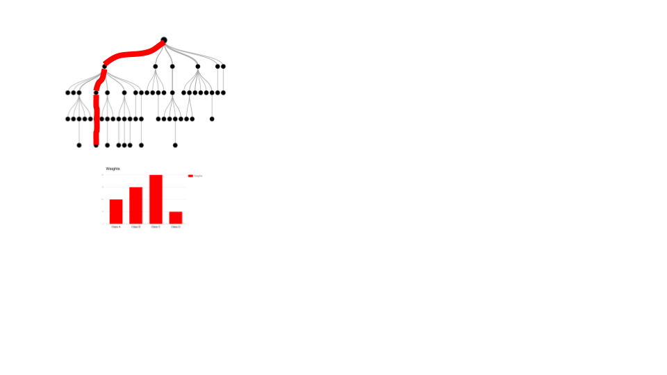
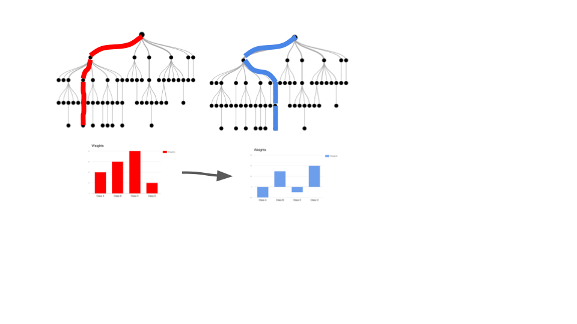
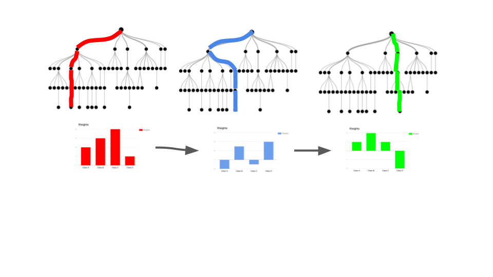
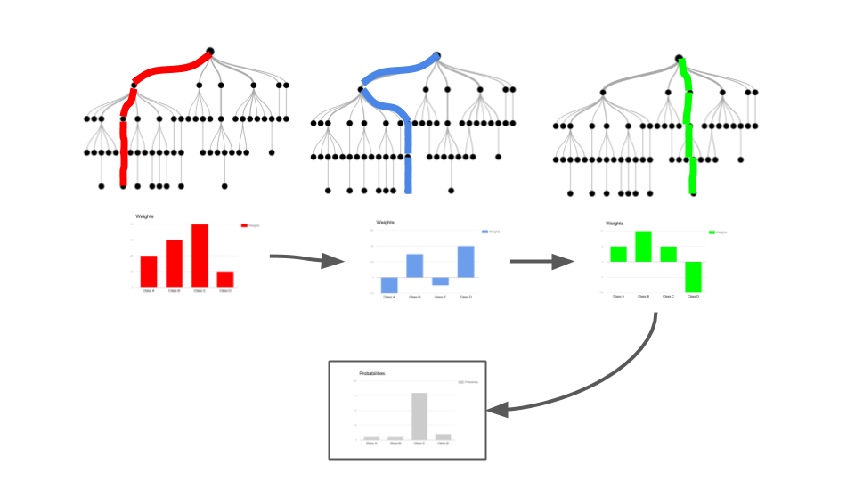
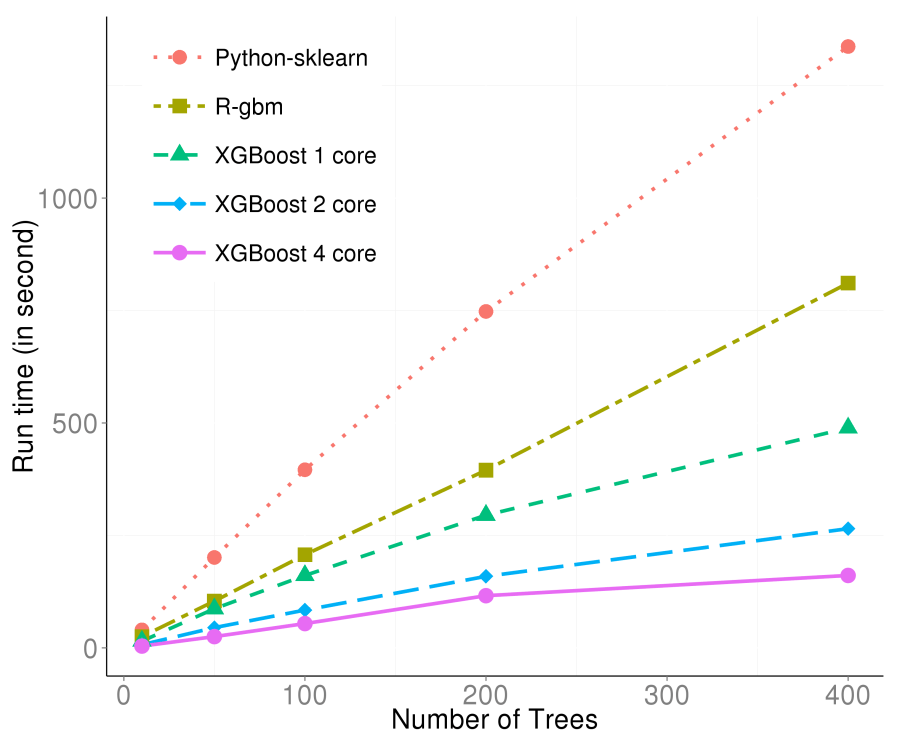

Applied Machine Learning 410
========================================================
css: ../../assets/style/uw.css
author: Justin Donaldson
date: March-23-2017
autosize: true

Trees and Forests
---------------------------------
(AKA: divide and concur)

Setup
=====

```r
opts_chunk$set(out.width='900px', dpi=200,cache=TRUE, fig.width=9, fig.height=5 )

options(width =1960)
local({r <- getOption("repos")
       r["CRAN"] <- "http://cran.r-project.org" 
       options(repos=r)
})
library(tree)
library(ggplot2)
library(GGally)
library(randomForest)
library(ggmosaic)
library(reshape2)
library(rpart)
library(caret)
library(e1071)
```


A Random Forest
===================
(Question - Is it Fall Yet?)
---------------

<a title="Daniel Case at the English language Wikipedia [GFDL (http://www.gnu.org/copyleft/fdl.html) or CC-BY-SA-3.0 (http://creativecommons.org/licenses/by-sa/3.0/)], via Wikimedia Commons" href="https://commons.wikimedia.org/wiki/File%3ABlack_Rock_Forest_view_from_NE.jpg"></a>

Black Rock Forest view from NE - Daniel Case

Overview
========
type:sub-section

* Why Random Forests?
* Why Decision Trees?
* Recap of Decision Trees
* Recap of Random Forests

Why Random Forests?
===================
type: section


Why Random Forests?
===================

***
Comparison of:
-------------

- Support Vector Machines
- Artificial Neural Networks
- Logistic Regression
- Naive Bayes
- K-Nearest Neighbors
- Random Forests
- Bagged Decision Trees
- Boosted Stumps
- Boosted Trees
- Perceptrons

Why Random Forests?
===================
Evaluation Data Sets:
--------------------
- Sturn, Calam : Ornithology
- Digits : MNIST handwritten
- Tis : mRNA translation sites
- Cryst : Protein Crystallography
- KDD98 : Donation Prediction
- R-S : Usenet real/simulation
- Cite : Paper Authorship
- Dse : Newswire
- Spam : TREC spam corpora
- Imdb : link prediction

***

Error Metrics:
-------------
- AUC : Area under curve
- ACC : Accuracy
- RMS : Root Mean Squared Error


Why are Forests useful?
==============================
Conclusions
-----------
- Boosted decision trees performed best when < 4000 dimensions
- Random forests performed best when > 4000
  - Easy to parellize
  - Scales efficiently to high dimensions
  - Performs consistently well on all three metrics
- Non-linear methods do well when model complexity is constrained
- Worst performing models : Naive Bayes and Perceptrons

Why are Random Forests are a Solid First Choice?
================================================
- Ensemble Based
- Handle boolean, categorical, numeric features with no scaling or factorization
- Few fussy hyperparameters (forest size  is commonly sqrt(#features))
- Automatic feature selection (within reason)
- Quick to train, parallelizable
- Resistant (somewhat) to overfitting
- OOB Random Forest error metric can substitute for CV
  - Stochastic gradient boosted trees have OOB

What are Random Forest Drawbacks?
=====================================================
- Less interpretable than trees
- Model size can become cumbersome

Why are Ensembles Better?
============================================
right : 80%


***
Sir Francis Galton
------------------
- Promoted Statistics and invented correlation
- In 1906 visited a livestock fair and stumbled on contest
- An ox was on display, villagers were invited to guess its weight
- ~800 made guesses, but nobody got the right answer (1,198 pounds)
- The average of the guesses came very close! (1,197 pounds)


An Intro to Decision Trees
========
Quick interactive intro
----
<blockquote class="twitter-tweet" data-lang="en"><p lang="en" dir="ltr">Machine learning explained in interactive visualizations (part 1) <a href="http://t.co/g75lLydMH9">http://t.co/g75lLydMH9</a> <a href="https://twitter.com/hashtag/d3js?src=hash">#d3js</a> <a href="https://twitter.com/hashtag/machinelearning?src=hash">#machinelearning</a></p>&mdash; r2d3.us (@r2d3us) <a href="https://twitter.com/r2d3us/status/625681063893864449">July 27, 2015</a></blockquote>
<script async src="//platform.twitter.com/widgets.js" charset="utf-8"></script>


Looking into Iris
==============

<a title="By Frank Mayfield [CC BY-SA 2.0 (http://creativecommons.org/licenses/by-sa/2.0)], via Wikimedia Commons" href="https://commons.wikimedia.org/wiki/File%3AIris_virginica.jpg"></a>

Iris Virginica 

*by Frank Mayfield*

***
<a title="By No machine-readable author provided. Dlanglois assumed (based on copyright claims). [GFDL (http://www.gnu.org/copyleft/fdl.html), CC-BY-SA-3.0 (http://creativecommons.org/licenses/by-sa/3.0/) or CC BY-SA 2.5 (http://creativecommons.org/licenses/by-sa/2.5)], via Wikimedia Commons" href="https://commons.wikimedia.org/wiki/File%3AIris_versicolor_3.jpg"></a>

Iris Versicolor 

*by Danielle Langlois*

Looking into Iris
=======


```r
head(iris, n=30)
```

```
   Sepal.Length Sepal.Width Petal.Length Petal.Width Species
1           5.1         3.5          1.4         0.2  setosa
2           4.9         3.0          1.4         0.2  setosa
3           4.7         3.2          1.3         0.2  setosa
4           4.6         3.1          1.5         0.2  setosa
5           5.0         3.6          1.4         0.2  setosa
6           5.4         3.9          1.7         0.4  setosa
7           4.6         3.4          1.4         0.3  setosa
8           5.0         3.4          1.5         0.2  setosa
9           4.4         2.9          1.4         0.2  setosa
10          4.9         3.1          1.5         0.1  setosa
11          5.4         3.7          1.5         0.2  setosa
12          4.8         3.4          1.6         0.2  setosa
13          4.8         3.0          1.4         0.1  setosa
14          4.3         3.0          1.1         0.1  setosa
15          5.8         4.0          1.2         0.2  setosa
16          5.7         4.4          1.5         0.4  setosa
17          5.4         3.9          1.3         0.4  setosa
18          5.1         3.5          1.4         0.3  setosa
19          5.7         3.8          1.7         0.3  setosa
20          5.1         3.8          1.5         0.3  setosa
21          5.4         3.4          1.7         0.2  setosa
22          5.1         3.7          1.5         0.4  setosa
23          4.6         3.6          1.0         0.2  setosa
24          5.1         3.3          1.7         0.5  setosa
25          4.8         3.4          1.9         0.2  setosa
26          5.0         3.0          1.6         0.2  setosa
27          5.0         3.4          1.6         0.4  setosa
28          5.2         3.5          1.5         0.2  setosa
29          5.2         3.4          1.4         0.2  setosa
30          4.7         3.2          1.6         0.2  setosa
```


Looking into Iris
=======
incremental : True
left : 70%

***
Leading Questions...
--------------------
* Petal dimensions important?
* Versicolor and Virginica separable?

Decision Tree - rpart
=======

```
Call:
rpart(formula = .outcome ~ ., data = list(Sepal.Length = c(5.1, 
4.9, 4.7, 4.6, 5, 5.4, 4.6, 5, 4.4, 4.9, 5.4, 4.8, 4.8, 4.3, 
5.8, 5.7, 5.4, 5.1, 5.7, 5.1, 5.4, 5.1, 4.6, 5.1, 4.8, 5, 5, 
5.2, 5.2, 4.7, 4.8, 5.4, 5.2, 5.5, 4.9, 5, 5.5, 4.9, 4.4, 5.1, 
5, 4.5, 4.4, 5, 5.1, 4.8, 5.1, 4.6, 5.3, 5, 7, 6.4, 6.9, 5.5, 
6.5, 5.7, 6.3, 4.9, 6.6, 5.2, 5, 5.9, 6, 6.1, 5.6, 6.7, 5.6, 
5.8, 6.2, 5.6, 5.9, 6.1, 6.3, 6.1, 6.4, 6.6, 6.8, 6.7, 6, 5.7, 
5.5, 5.5, 5.8, 6, 5.4, 6, 6.7, 6.3, 5.6, 5.5, 5.5, 6.1, 5.8, 
5, 5.6, 5.7, 5.7, 6.2, 5.1, 5.7, 6.3, 5.8, 7.1, 6.3, 6.5, 7.6, 
4.9, 7.3, 6.7, 7.2, 6.5, 6.4, 6.8, 5.7, 5.8, 6.4, 6.5, 7.7, 7.7, 
6, 6.9, 5.6, 7.7, 6.3, 6.7, 7.2, 6.2, 6.1, 6.4, 7.2, 7.4, 7.9, 
6.4, 6.3, 6.1, 7.7, 6.3, 6.4, 6, 6.9, 6.7, 6.9, 5.8, 6.8, 6.7, 
6.7, 6.3, 6.5, 6.2, 5.9), Sepal.Width = c(3.5, 3, 3.2, 3.1, 3.6, 
3.9, 3.4, 3.4, 2.9, 3.1, 3.7, 3.4, 3, 3, 4, 4.4, 3.9, 3.5, 3.8, 
3.8, 3.4, 3.7, 3.6, 3.3, 3.4, 3, 3.4, 3.5, 3.4, 3.2, 3.1, 3.4, 
4.1, 4.2, 3.1, 3.2, 3.5, 3.6, 3, 3.4, 3.5, 2.3, 3.2, 3.5, 3.8, 
3, 3.8, 3.2, 3.7, 3.3, 3.2, 3.2, 3.1, 2.3, 2.8, 2.8, 3.3, 2.4, 
2.9, 2.7, 2, 3, 2.2, 2.9, 2.9, 3.1, 3, 2.7, 2.2, 2.5, 3.2, 2.8, 
2.5, 2.8, 2.9, 3, 2.8, 3, 2.9, 2.6, 2.4, 2.4, 2.7, 2.7, 3, 3.4, 
3.1, 2.3, 3, 2.5, 2.6, 3, 2.6, 2.3, 2.7, 3, 2.9, 2.9, 2.5, 2.8, 
3.3, 2.7, 3, 2.9, 3, 3, 2.5, 2.9, 2.5, 3.6, 3.2, 2.7, 3, 2.5, 
2.8, 3.2, 3, 3.8, 2.6, 2.2, 3.2, 2.8, 2.8, 2.7, 3.3, 3.2, 2.8, 
3, 2.8, 3, 2.8, 3.8, 2.8, 2.8, 2.6, 3, 3.4, 3.1, 3, 3.1, 3.1, 
3.1, 2.7, 3.2, 3.3, 3, 2.5, 3, 3.4, 3), Petal.Length = c(1.4, 
1.4, 1.3, 1.5, 1.4, 1.7, 1.4, 1.5, 1.4, 1.5, 1.5, 1.6, 1.4, 1.1, 
1.2, 1.5, 1.3, 1.4, 1.7, 1.5, 1.7, 1.5, 1, 1.7, 1.9, 1.6, 1.6, 
1.5, 1.4, 1.6, 1.6, 1.5, 1.5, 1.4, 1.5, 1.2, 1.3, 1.4, 1.3, 1.5, 
1.3, 1.3, 1.3, 1.6, 1.9, 1.4, 1.6, 1.4, 1.5, 1.4, 4.7, 4.5, 4.9, 
4, 4.6, 4.5, 4.7, 3.3, 4.6, 3.9, 3.5, 4.2, 4, 4.7, 3.6, 4.4, 
4.5, 4.1, 4.5, 3.9, 4.8, 4, 4.9, 4.7, 4.3, 4.4, 4.8, 5, 4.5, 
3.5, 3.8, 3.7, 3.9, 5.1, 4.5, 4.5, 4.7, 4.4, 4.1, 4, 4.4, 4.6, 
4, 3.3, 4.2, 4.2, 4.2, 4.3, 3, 4.1, 6, 5.1, 5.9, 5.6, 5.8, 6.6, 
4.5, 6.3, 5.8, 6.1, 5.1, 5.3, 5.5, 5, 5.1, 5.3, 5.5, 6.7, 6.9, 
5, 5.7, 4.9, 6.7, 4.9, 5.7, 6, 4.8, 4.9, 5.6, 5.8, 6.1, 6.4, 
5.6, 5.1, 5.6, 6.1, 5.6, 5.5, 4.8, 5.4, 5.6, 5.1, 5.1, 5.9, 5.7, 
5.2, 5, 5.2, 5.4, 5.1), Petal.Width = c(0.2, 0.2, 0.2, 0.2, 0.2, 
0.4, 0.3, 0.2, 0.2, 0.1, 0.2, 0.2, 0.1, 0.1, 0.2, 0.4, 0.4, 0.3, 
0.3, 0.3, 0.2, 0.4, 0.2, 0.5, 0.2, 0.2, 0.4, 0.2, 0.2, 0.2, 0.2, 
0.4, 0.1, 0.2, 0.2, 0.2, 0.2, 0.1, 0.2, 0.2, 0.3, 0.3, 0.2, 0.6, 
0.4, 0.3, 0.2, 0.2, 0.2, 0.2, 1.4, 1.5, 1.5, 1.3, 1.5, 1.3, 1.6, 
1, 1.3, 1.4, 1, 1.5, 1, 1.4, 1.3, 1.4, 1.5, 1, 1.5, 1.1, 1.8, 
1.3, 1.5, 1.2, 1.3, 1.4, 1.4, 1.7, 1.5, 1, 1.1, 1, 1.2, 1.6, 
1.5, 1.6, 1.5, 1.3, 1.3, 1.3, 1.2, 1.4, 1.2, 1, 1.3, 1.2, 1.3, 
1.3, 1.1, 1.3, 2.5, 1.9, 2.1, 1.8, 2.2, 2.1, 1.7, 1.8, 1.8, 2.5, 
2, 1.9, 2.1, 2, 2.4, 2.3, 1.8, 2.2, 2.3, 1.5, 2.3, 2, 2, 1.8, 
2.1, 1.8, 1.8, 1.8, 2.1, 1.6, 1.9, 2, 2.2, 1.5, 1.4, 2.3, 2.4, 
1.8, 1.8, 2.1, 2.4, 2.3, 1.9, 2.3, 2.5, 2.3, 1.9, 2, 2.3, 1.8
), .outcome = c(1, 1, 1, 1, 1, 1, 1, 1, 1, 1, 1, 1, 1, 1, 1, 
1, 1, 1, 1, 1, 1, 1, 1, 1, 1, 1, 1, 1, 1, 1, 1, 1, 1, 1, 1, 1, 
1, 1, 1, 1, 1, 1, 1, 1, 1, 1, 1, 1, 1, 1, 2, 2, 2, 2, 2, 2, 2, 
2, 2, 2, 2, 2, 2, 2, 2, 2, 2, 2, 2, 2, 2, 2, 2, 2, 2, 2, 2, 2, 
2, 2, 2, 2, 2, 2, 2, 2, 2, 2, 2, 2, 2, 2, 2, 2, 2, 2, 2, 2, 2, 
2, 3, 3, 3, 3, 3, 3, 3, 3, 3, 3, 3, 3, 3, 3, 3, 3, 3, 3, 3, 3, 
3, 3, 3, 3, 3, 3, 3, 3, 3, 3, 3, 3, 3, 3, 3, 3, 3, 3, 3, 3, 3, 
3, 3, 3, 3, 3, 3, 3, 3, 3)), control = list(minsplit = 20, minbucket = 7, 
    cp = 0, maxcompete = 4, maxsurrogate = 5, usesurrogate = 2, 
    surrogatestyle = 0, maxdepth = 30, xval = 0))
  n= 150 

    CP nsplit rel error
1 0.50      0      1.00
2 0.44      1      0.50
3 0.00      2      0.06

Variable importance
 Petal.Width Petal.Length Sepal.Length  Sepal.Width 
          34           31           21           14 

Node number 1: 150 observations,    complexity param=0.5
  predicted class=setosa      expected loss=0.6666667  P(node) =1
    class counts:    50    50    50
   probabilities: 0.333 0.333 0.333 
  left son=2 (50 obs) right son=3 (100 obs)
  Primary splits:
      Petal.Length < 2.45 to the left,  improve=50.00000, (0 missing)
      Petal.Width  < 0.8  to the left,  improve=50.00000, (0 missing)
      Sepal.Length < 5.45 to the left,  improve=34.16405, (0 missing)
      Sepal.Width  < 3.35 to the right, improve=19.03851, (0 missing)
  Surrogate splits:
      Petal.Width  < 0.8  to the left,  agree=1.000, adj=1.00, (0 split)
      Sepal.Length < 5.45 to the left,  agree=0.920, adj=0.76, (0 split)
      Sepal.Width  < 3.35 to the right, agree=0.833, adj=0.50, (0 split)

Node number 2: 50 observations
  predicted class=setosa      expected loss=0  P(node) =0.3333333
    class counts:    50     0     0
   probabilities: 1.000 0.000 0.000 

Node number 3: 100 observations,    complexity param=0.44
  predicted class=versicolor  expected loss=0.5  P(node) =0.6666667
    class counts:     0    50    50
   probabilities: 0.000 0.500 0.500 
  left son=6 (54 obs) right son=7 (46 obs)
  Primary splits:
      Petal.Width  < 1.75 to the left,  improve=38.969400, (0 missing)
      Petal.Length < 4.75 to the left,  improve=37.353540, (0 missing)
      Sepal.Length < 6.15 to the left,  improve=10.686870, (0 missing)
      Sepal.Width  < 2.45 to the left,  improve= 3.555556, (0 missing)
  Surrogate splits:
      Petal.Length < 4.75 to the left,  agree=0.91, adj=0.804, (0 split)
      Sepal.Length < 6.15 to the left,  agree=0.73, adj=0.413, (0 split)
      Sepal.Width  < 2.95 to the left,  agree=0.67, adj=0.283, (0 split)

Node number 6: 54 observations
  predicted class=versicolor  expected loss=0.09259259  P(node) =0.36
    class counts:     0    49     5
   probabilities: 0.000 0.907 0.093 

Node number 7: 46 observations
  predicted class=virginica   expected loss=0.02173913  P(node) =0.3066667
    class counts:     0     1    45
   probabilities: 0.000 0.022 0.978 
```

Decision Tree
=======

```r
plot(m$finalModel)
text(m$finalModel)
```


Decision Tree
=======

```r
plot(varImp(m)) 
```


***
Luckily, we can get a measure of the *importance* of each field according to the model.
- importance can be defined a number of different ways :
  - Reduction in MSE (used in rpart)
  - Accuracy
  - Gini metric
- importance does *not* imply positive or negative correlation

Loss/Split Metrics
=====
type : sub-section


Gini impurity 
====
$$
G = \sum^{n_c}_{i=1}p_i(1-p_i)
$$
- How often a randomly chosen element would be labeled *incorrectly* if it were labeled *randomly* according to current label distribution
- $n_c$: number of classes
- $p_i$: ratio of the class

Information gain  
====
type : small-equation
$$
IG(Ex,a)=H(Ex) -\sum_{v\in values(a)} \left(\frac{|\{x\in Ex|value(x,a)=v\}|}{|Ex|} \cdot H(\{x\in Ex|value(x,a)=v\})\right)
$$
or
$$
IG(T,a) = H(T) - H(T|a)
$$
- $H$ : entropy
- $E_x$ : set of all attributes
- $values(a)$ : set of all possible values for attribute
- In summary : if we hold one attibute to $a$, how does this change the *information entropy*?
  - Also, what the heck is *information entropy*?
  
Information Entropy
====
$$
H(X) = \sum_{i=1}^n {\mathrm{P}(x_i)\,\mathrm{I}(x_i)} = -\sum_{i=1}^n {\mathrm{P}(x_i) \log_b \mathrm{P}(x_i)}
$$
- $X$ : discrete random variable with ${x_1, ..., x_n}$
- $P$ : probability mass function  :  $f_X(x) = \Pr(X = x) = \Pr(\{s \in S: X(s) = x\}$
  - all values are non-negative and sum to 1
- $I(X)$ : Information content of $X$
- $b$ : logarithm base (usually 2 - gain expressed in bits)

Information Entropy
====

```r
eta = function(h){
  t = 1-h
  - ((h * log2(h)) + (t * log2(t)))
}
```
- information is at maximum when entropy (eta) at maximum
- log scaling (by log 2) gives *unit* on a fair coin flip (i.e. think in bits)

***

```r
# odds of flipping heads
heads = (0:10)/10
heads
```

```
 [1] 0.0 0.1 0.2 0.3 0.4 0.5 0.6 0.7 0.8 0.9 1.0
```

```r
plot(heads,eta(heads), type='l')
```


Information Entropy
====
Splitting algorithm seeks *minimal entropy* splits
- each branch should have biased (homogeneous) likelihoods for certain classes
- maximizing on information gain at each split point ensures tree depth is minimal

Information gain  
====
- *Overemphasizes fields with large numbers of labels* - Why?
  - Fix this by taking "top n" labels (which can reduce accuracy)
  - Fix this by taking *information gain ratio*, which requires normalizing by *intrinsic value*


Intrinsic value
====
type : small-equation
$$
IV(Ex,a)= -\sum_{v\in values(a)} \frac{|\{x\in Ex|value(x,a)=v\}|}{|Ex|} \cdot \log_2\left(\frac{|\{x\in Ex|value(x,a)=v\}|}{|Ex|}\right)
$$
- the denomintor in Information gain ratio 
- establish a value 


Variance reduction
====
type : small-equation
What if we want to handle *regression* trees?
----
$$
I_{V}(N) = \frac{1}{|S|^2}\sum_{i\in S} \sum_{j\in S} \frac{1}{2}(x_i - x_j)^2 - \left(\frac{1}{|S_t|^2}\sum_{i\in S_t} \sum_{j\in S_t} \frac{1}{2}(x_i - x_j)^2 + \frac{1}{|S_f|^2}\sum_{i\in S_f} \sum_{j\in S_f} \frac{1}{2}(x_i - x_j)^2\right)
$$
- $S,S_t,S_f$ : set of presplit sample indices
- Minimize the mean squared error of the two branches with a given split

Further Tree Methods
======
type : sub-section

Partition Tree
==============
A nice option if you have exactly 2 input dimensions

```r
tree1 <- tree(Species ~ Petal.Length + Petal.Width, data = iris)
plot(iris$Petal.Length,iris$Petal.Width,pch=19,col=as.numeric(iris$Species))
partition.tree(tree1,label="Species",add=TRUE)
legend(1.75,4.5,legend=unique(iris$Species),col=unique(as.numeric(iris$Species)),pch=19)
```

Partition Tree
==============
A nice option if you have exactly 2 input dimensions


Deep Dive into Forests
==============
type : sub-section
Now that we've recapped the basics of trees, time to go back into forests.


Iris Deep Dive
============
type : sub-section
Let's use Iris as a way of showing various Forest-based modeling/analysis techniques

```r
library(randomForest)
```


Looking into Iris
===

```r
data(iris)
iris.rf <- randomForest(Species ~ ., iris, importance=T)
iris.rf
```

```

Call:
 randomForest(formula = Species ~ ., data = iris, importance = T) 
               Type of random forest: classification
                     Number of trees: 500
No. of variables tried at each split: 2

        OOB estimate of  error rate: 4%
Confusion matrix:
           setosa versicolor virginica class.error
setosa         50          0         0        0.00
versicolor      0         47         3        0.06
virginica       0          3        47        0.06
```

Looking into Iris
===

```r
# get tree #23 from the model
getTree(iris.rf,k=23)
```

```
   left daughter right daughter split var split point status prediction
1              2              3         4        0.80      1          0
2              0              0         0        0.00     -1          1
3              4              5         3        4.95      1          0
4              6              7         3        4.85      1          0
5              8              9         2        2.75      1          0
6             10             11         1        4.95      1          0
7             12             13         1        6.60      1          0
8             14             15         4        1.75      1          0
9              0              0         0        0.00     -1          3
10            16             17         4        1.35      1          0
11             0              0         0        0.00     -1          2
12            18             19         1        6.20      1          0
13             0              0         0        0.00     -1          2
14             0              0         0        0.00     -1          2
15             0              0         0        0.00     -1          3
16             0              0         0        0.00     -1          2
17             0              0         0        0.00     -1          3
18             0              0         0        0.00     -1          3
19            20             21         4        1.65      1          0
20             0              0         0        0.00     -1          2
21             0              0         0        0.00     -1          3
```
Unfortunately, it's very difficult to inspect individual trees, or form an understanding of how they reach consensus on a given case.

Looking into Iris
===

```r
varImpPlot(iris.rf)
```


Example : Tweak one variable while holding training set fixed
=======

```r
irisTweak = function(var){ 
  dummy = iris
  idx = seq(min(dummy[var]), max(dummy[var]), by=.01)
  probs = sapply(idx, function(x) {
    dummy[var] = x; 
    apply(predict(iris.rf, dummy, type='prob'),2,mean)
  })
  dat = as.data.frame(t(apply(probs,2,unlist)))
  dat[var] = idx;
  dat = melt(dat, id.vars=var)
  colnames(dat)[colnames(dat) == 'value'] <- 'probability'
  ggplot(dat, aes_string(x=var, y='probability', color='variable')) + 
    geom_line(alpha=.8, aes(size=2)) + guides(size=F)
} 
# E.g.
#irisTweak("Petal.Length") 
```

Example : Tweak Petal.Length while holding training set fixed
=======


Example : Tweak Petal.Width
=======


Example : Tweak Sepal.Length 
=======


Example : Tweak Sepal.Width
=======


RF vs. GBT
=====
Random forests are trained/evaluated independently
----


RF vs. GBT
=====
The resulting class probabilities (or regressions) are *averaged*.
----


RF vs. GBT
=====
GBTs, on the other hand, are trained sequentially.
----


RF vs. GBT
=====
Errors (residual) from the first tree are used to train the second.
----


RF vs. GBT
=====
And so on...
----


RF vs. GBT
=====
The results of all trees are *summed* 
----



Deep Dive into Agaricus with Gradient Boosted Trees
=========
Modeling question : Is this safe to eat?
--------
<a title="By George Chernilevsky (Own work) [Public domain], via Wikimedia Commons" href="https://commons.wikimedia.org/wiki/File%3AAgaricus_augustus_2011_G1.jpg"></a>


Agaricus Data
========
We have a variety of measurements/classes, and a label (poisonous/not)

```r
  library(xgboost)
  library(DiagrammeR)
  data(agaricus.train)
  data(agaricus.test)
  train <- agaricus.train
  test <- agaricus.test
  dim(agaricus.train$data)
```

```
[1] 6513  126
```

```r
  head(cbind(as.matrix(agaricus.train$data)[,1:3], etc="...", label=agaricus.train$label))
```

```
     cap-shape=bell cap-shape=conical cap-shape=convex etc   label
[1,] "0"            "0"               "1"              "..." "1"  
[2,] "0"            "0"               "1"              "..." "0"  
[3,] "1"            "0"               "0"              "..." "0"  
[4,] "0"            "0"               "1"              "..." "1"  
[5,] "0"            "0"               "1"              "..." "0"  
[6,] "0"            "0"               "1"              "..." "0"  
```


Gradient Boosted Trees
=========
GBT models were some of the best performing classifications models in the original study.
----
But, they require more parameters than forests :
- objective = "binary:logistic" : Training a binary classifier
- max_depth = 2 : The trees are shallow (atypically low)
- nrounds = 2 : Two passes on the data (low)
- eta = 1 : Control the learning rate (high)
- verbose = 2 : Add more debug information on the tress (high)

Gradient Boosted Trees
=========
Build
----

```r
bst <- xgboost(data = train$data,  objective = "binary:logistic", label = train$label, max_depth = 2, nrounds = 2, eta = 1, verbose=2)
```

```
[11:24:47] amalgamation/../src/tree/updater_prune.cc:74: tree pruning end, 1 roots, 6 extra nodes, 0 pruned nodes, max_depth=2
[1]	train-error:0.046522 
[11:24:47] amalgamation/../src/tree/updater_prune.cc:74: tree pruning end, 1 roots, 4 extra nodes, 0 pruned nodes, max_depth=2
[2]	train-error:0.022263 
```

Gradient Boosted Trees
=========
Visualize
-----

```r
xgb.plot.tree(feature_names = colnames(agaricus.train$data), model=bst)
```


Gradient Boosted Trees
=========
Evaluate
-----

```r
pred = predict(bst, test$data)
head(pred)
```

```
[1] 0.28583017 0.92392391 0.28583017 0.28583017 0.05169873 0.92392391
```

```r
pred_label = as.numeric(pred > .5)
```
Test error:

```r
mean(as.numeric((pred  > .5) != test$label))
```

```
[1] 0.02172564
```
Not bad, but consider risk of false positive!


XGBoost performance
=======

***
 - taken from recent Higgs Boson competition on Kaggle
 - XGBoost takes advantage of multiple cores
 - Available on multiple platforms


Deep Dive into Adult.csv
=======================


Deep Dive into Adult.csv
=======================

```r
adult = read.csv("../../../data/adult.csv", header=T, stringsAsFactors=T,nrow=100)
head(adult[names(adult)[1:5]])
```

```
  age        workclass fnlwgt education education.num
1  39        State-gov  77516 Bachelors            13
2  50 Self-emp-not-inc  83311 Bachelors            13
3  38          Private 215646   HS-grad             9
4  53          Private 234721      11th             7
5  28          Private 338409 Bachelors            13
6  37          Private 284582   Masters            14
```

```r
head(adult[names(adult)[6:10]])
```

```
      marital.status        occupation  relationship  race    sex
1      Never-married      Adm-clerical Not-in-family White   Male
2 Married-civ-spouse   Exec-managerial       Husband White   Male
3           Divorced Handlers-cleaners Not-in-family White   Male
4 Married-civ-spouse Handlers-cleaners       Husband Black   Male
5 Married-civ-spouse    Prof-specialty          Wife Black Female
6 Married-civ-spouse   Exec-managerial          Wife White Female
```

```r
#continued...
```

Deep Dive into Adult.csv
=======================

```r
#...continued
head(adult[names(adult)[11:15]])
```

```
  capital.gain capital.loss hours.per.week native.country class
1         2174            0             40  United-States <=50K
2            0            0             13  United-States <=50K
3            0            0             40  United-States <=50K
4            0            0             40  United-States <=50K
5            0            0             40           Cuba <=50K
6            0            0             40  United-States <=50K
```


Deep Dive into Adult.csv
=======================
the "topn" function : filter out all but the top "n" occuring labels (the rest get NA)

```r
topn = function(d, top=25, otherlabel=NA) {
    ret = d
    ret[ret == ""] <-NA
    topnames = names(head(sort(table(ret),d=T),top))
    ret[!ret %in% topnames] <-NA
    if (!is.na(otherlabel)){
        ret[is.na(ret)] = otherlabel
    }
    factor(ret)
}
label_data = c('foo','bar','foo','bar', 'baz', 'boo', 'bing')
topn(label_data, top=2)
```

```
[1] foo  bar  foo  bar  <NA> <NA> <NA>
Levels: bar foo
```


Deep Dive into Adult.csv
=======================

```r
filter_feature=function(x, top=25){
 if (is.numeric(x)){ 
   # If numeric, calculate histogram breaks
   hx = hist(x,plot=F)
   x = hx$breaks[findInterval(x, hx$breaks)]
 } else { 
   # Otherwise, capture only top n (25) labels
   x = topn(x,top)
 }
 x 
}
num_data = rnorm(5)
num_data
```

```
[1] -1.223677 -0.261312  2.487786 -1.274416  1.129566
```

```r
filter_feature(num_data)
```

```
[1] -2 -1  2 -2  1
```

```r
filter_feature(label_data,top=2)
```

```
[1] foo  bar  foo  bar  <NA> <NA> <NA>
Levels: bar foo
```

Deep Dive into Adult.csv
=======================

```r
mosaic_feature = function(feature){
 x = filter_feature(adult[[feature]])
 d = data.frame(class=adult$class, fnlwgt=adult$fnlwgt)
 d[feature] = x
 ggplot(d, aes(weight=fnlwgt, fill=factor(class))) +  
   geom_mosaic(aes_string(x=paste0("product(class,", feature, ")"))) +
   labs(title=paste(feature, "vs. class")) + 
   theme(axis.text.x = element_text(size=20,angle = 45, hjust = 1))
}
```


Deep Dive into Adult.csv
=======================


Deep Dive into Adult.csv
=======================


Deep Dive into Adult.csv
=======================


Deep Dive into Adult.csv
=======================


Deep Dive into Adult.csv
=======================


Deep Dive into Adult.csv
=======================


Deep Dive into Adult.csv
=======================


Deep Dive into Adult.csv
=======================


Deep Dive into Adult.csv
========================

```r
rf = randomForest(class ~ . , adult, importance=T)
rf
```

```

Call:
 randomForest(formula = class ~ ., data = adult, importance = T) 
               Type of random forest: classification
                     Number of trees: 500
No. of variables tried at each split: 3

        OOB estimate of  error rate: 18%
Confusion matrix:
      <=50K >50K class.error
<=50K    73    2  0.02666667
>50K     16    9  0.64000000
```

Deep Dive into Adult.csv
========================

```r
varImpPlot(rf)
```


Deep Dive into Adult.csv
========================
We need to clear leakage/noise variables
----

```r
adult2 = adult
adult2$capital.gain = NULL
adult2$capital.loss = NULL
adult2$fnlwgt = NULL
rf = randomForest(class ~ . , adult2, importance=T)
```


Deep Dive into Adult.csv
========================

```r
varImpPlot(rf)
```


Adult.csv conclusions
========================
type : sub-section
- Random forest models salary using the fields we believed were important
- However, what are the ethics considerations here?
- What are different types of bias that you can encounter? 

Conclusion
======
type : sub-section
- Trees are unreasonably effective!
- Trees:
  - fast/flexible
  - among most intuitive models
- Random forests :
  - only 1 common hyperparameter
  - dominant when >4K features
  - embarassingly parallel training, predictions
  - OOB error rates allow use of entire dataset for training
- Gradient Boosted Trees :
  - dominant when <4K features
  - few hyperparameters compared to more sophisticated linear models.
  - fast training with specialized libraries.
  - OOB error rates with stochastic gradient boosting

  


