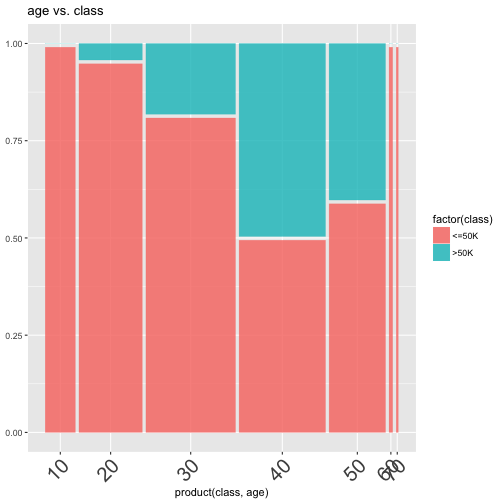
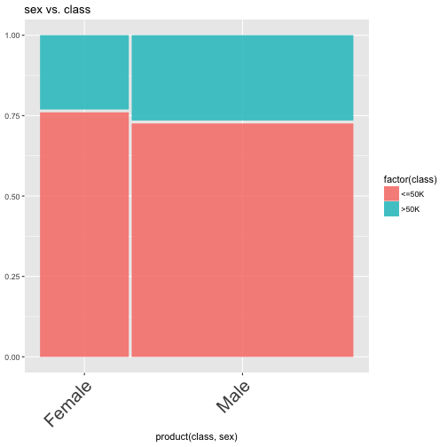
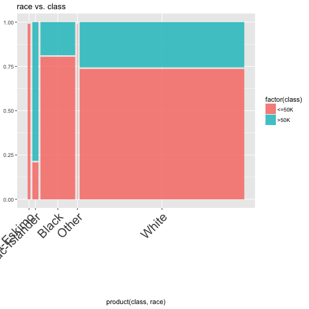
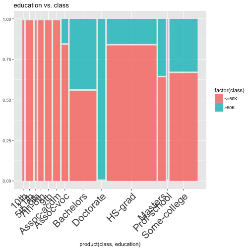
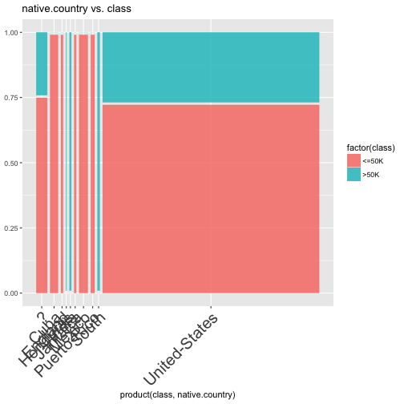
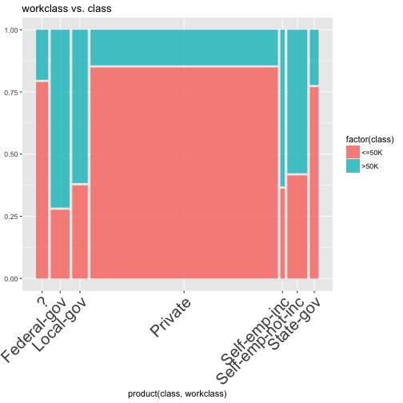
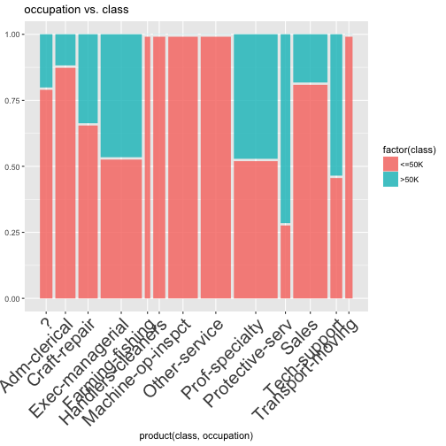
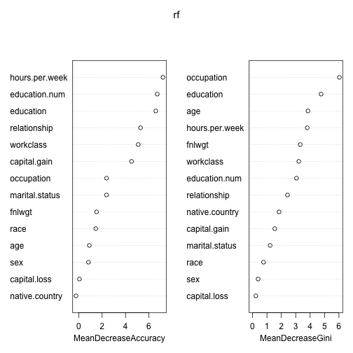
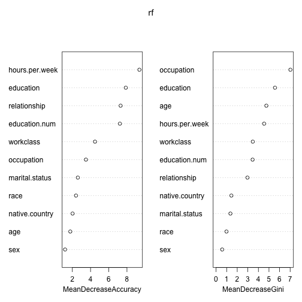

Deep Dive into Adult.csv
=======================


Deep Dive into Adult.csv
=======================

```r
adult = read.csv("../../../data/adult.csv", header=T, stringsAsFactors=T,nrow=100)
head(adult[names(adult)[1:5]])
```

```
  age        workclass fnlwgt education education.num
1  39        State-gov  77516 Bachelors            13
2  50 Self-emp-not-inc  83311 Bachelors            13
3  38          Private 215646   HS-grad             9
4  53          Private 234721      11th             7
5  28          Private 338409 Bachelors            13
6  37          Private 284582   Masters            14
```

```r
head(adult[names(adult)[6:10]])
```

```
      marital.status        occupation  relationship  race    sex
1      Never-married      Adm-clerical Not-in-family White   Male
2 Married-civ-spouse   Exec-managerial       Husband White   Male
3           Divorced Handlers-cleaners Not-in-family White   Male
4 Married-civ-spouse Handlers-cleaners       Husband Black   Male
5 Married-civ-spouse    Prof-specialty          Wife Black Female
6 Married-civ-spouse   Exec-managerial          Wife White Female
```

```r
#continued...
```

Deep Dive into Adult.csv
=======================

```r
#...continued
head(adult[names(adult)[11:15]])
```

```
  capital.gain capital.loss hours.per.week native.country class
1         2174            0             40  United-States <=50K
2            0            0             13  United-States <=50K
3            0            0             40  United-States <=50K
4            0            0             40  United-States <=50K
5            0            0             40           Cuba <=50K
6            0            0             40  United-States <=50K
```


Deep Dive into Adult.csv
=======================
the "topn" function : filter out all but the top "n" occuring labels (the rest get NA)

```r
topn = function(d, top=25, otherlabel=NA) {
    ret = d
    ret[ret == ""] <-NA
    topnames = names(head(sort(table(ret),d=T),top))
    ret[!ret %in% topnames] <-NA
    if (!is.na(otherlabel)){
        ret[is.na(ret)] = otherlabel
    }
    factor(ret)
}
label_data = c('foo','bar','foo','bar', 'baz', 'boo', 'bing')
topn(label_data, top=2)
```

```
[1] foo  bar  foo  bar  <NA> <NA> <NA>
Levels: bar foo
```


Deep Dive into Adult.csv
=======================

```r
filter_feature=function(x, top=25){
 if (is.numeric(x)){ 
   # If numeric, calculate histogram breaks
   hx = hist(x,plot=F)
   x = hx$breaks[findInterval(x, hx$breaks)]
 } else { 
   # Otherwise, capture only top n (25) labels
   x = topn(x,top)
 }
 x 
}
num_data = rnorm(5)
num_data
```

```
[1] -0.01507078  0.62074846  0.50047895 -0.09441472 -2.04675572
```

```r
filter_feature(num_data)
```

```
[1] -0.5  0.5  0.5 -0.5 -2.5
```

```r
filter_feature(label_data,top=2)
```

```
[1] foo  bar  foo  bar  <NA> <NA> <NA>
Levels: bar foo
```

Deep Dive into Adult.csv
=======================

```r
mosaic_feature = function(feature){
 x = filter_feature(adult[[feature]])
 d = data.frame(class=adult$class, fnlwgt=adult$fnlwgt)
 d[feature] = x
 ggplot(d, aes(weight=fnlwgt, fill=factor(class))) +  
   geom_mosaic(aes_string(x=paste0("product(class,", feature, ")"))) +
   labs(title=paste(feature, "vs. class")) + 
   theme(axis.text.x = element_text(size=20,angle = 45, hjust = 1))
}
mosaic_feature("age")
```



Deep Dive into Adult.csv
=======================


Deep Dive into Adult.csv
=======================


Deep Dive into Adult.csv
=======================


Deep Dive into Adult.csv
=======================


Deep Dive into Adult.csv
=======================


Deep Dive into Adult.csv
=======================



Deep Dive into Adult.csv
=======================


Deep Dive into Adult.csv
=======================



Deep Dive into Adult.csv
========================

```r
rf = randomForest(class ~ . , adult, importance=T)
rf
```

```

Call:
 randomForest(formula = class ~ ., data = adult, importance = T) 
               Type of random forest: classification
                     Number of trees: 500
No. of variables tried at each split: 3

        OOB estimate of  error rate: 18%
Confusion matrix:
      <=50K >50K class.error
<=50K    72    3        0.04
>50K     15   10        0.60
```

Deep Dive into Adult.csv
========================

```r
varImpPlot(rf)
```


Deep Dive into Adult.csv
========================

```r
varImpPlot(rf)
```




Deep Dive into Adult.csv
========================

```r
adult2 = adult
adult2$capital.gain = NULL
adult2$capital.loss = NULL
adult2$fnlwgt = NULL
rf = randomForest(class ~ . , adult2, importance=T)
```


Deep Dive into Adult.csv
========================

```r
varImpPlot(rf)
```


